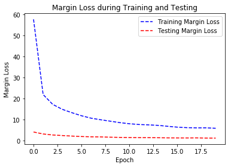
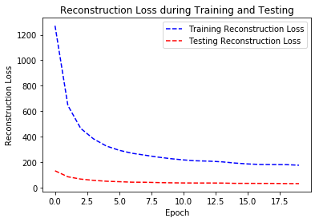
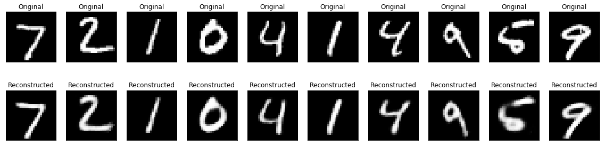


### CapsNet in Tensorflow 1.8.0

A Capsule Network with Dynamic routing based on https://arxiv.org/abs/1710.09829 for MNIST classification with comments and explanations.

Training Margin Loss :

Training Reconstruction Loss :

Training Accuracy :

Reconstructed Images:

